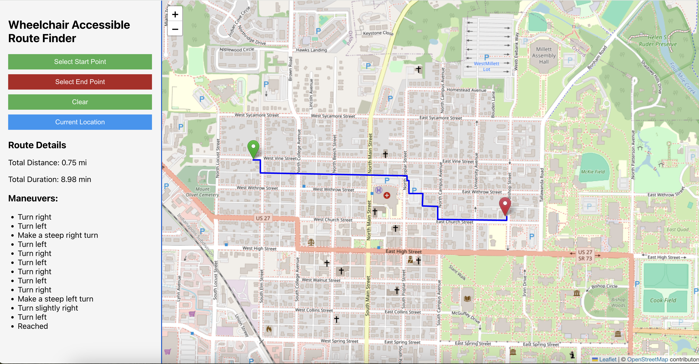

# MyPath Backend

MyPath is an application backend designed to generate wheelchair-accessible routes for wheelchair users. It provides essential services to ensure accessibility and ease of navigation.

## Features

- Generate wheelchair-friendly routes.
- Support for integration with frontend applications.

## Sample Image

Below is a sample image of a route displayed in a basic React app:

